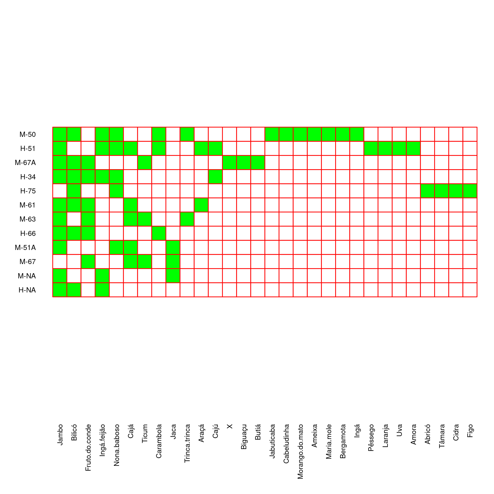
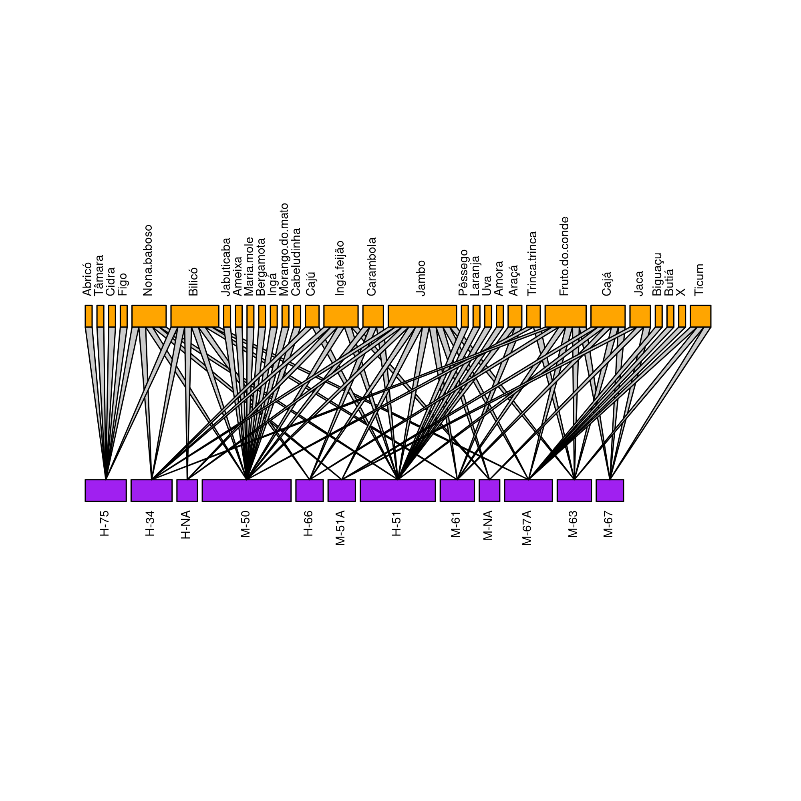

# Frutos consumidos antigamente citados por moradores de uma comunidade tradicional de pescadores artesanais em Florianópolis, SC.

Pesquisa feita por alunos da [Escola Básica Municipal da Costa da Lagoa](https://comparaescola.com/index.php/escola-municipal-ebm-costa-da-lagoa-servidao-caminho-costa-da-lagoa-0-ponto-16-lagoa-da-conceicao-88062-370-florianopolis-sc/). Os dados foram passados para uma _edge table_ e a tabela e a rede abaixo foram construidos usando o [R](https://www.r-project.org/)

Eles perguntaram para os familiares mais velhos **quais os frutos eram mais consumidos antigamente**. `r emo::ji("banana")

### Resultados

Os 12 informantes citaram um total de 30 frutos de acordo com a tabela abaixo.

#### Análise da rede

Os retângulos roxos na parte inferior da rede se referem aos informates intrevistados pelas crianças. Os informantes estão identificados por uma legenda referente a sexo (M ou H) e idade. O tamanho dos retângulos roxos são proporcionais so número de frutos citados por aquela pessoa.

Na parte superior, em laranja, estão os frutos citados pelos informates. O tamanho dos retângulos laranjas é proporcional ao número de vezes que aquele fruto foi citado. As linhas em cinza conectam os informantes aos frutos que eles citaram.

Alguns informates se destacam por um grande número de ligações (M-50; H-51, M-67A), ou seja, citaram mais frutos do que outros informantes. Da mesma forma, alguns frutos foram citados mais vezes do que outros, como o Jambo, Bilicó e Fruto do Conde.

Os frutos menos citados foram lembrados pelos informates que fizeram mais citações. 

Estes resultados estão enviesados pelas lembranças e preferências dos informantes.

Mesmo assim, é interessante notar que muitos frutos citados com maior frequência não existem mais hoje em dia ou pelo menos não são tão comuns, como podemos notar nos resultados do [Projeto Frutos da Costa](https://frutosdacosta.netlify.app/species.html).

Os próximos passos são:

- 1. Fazer réplicas sobre os frutos consumidos antigamente;

- 2. Levantar dados dos frutos existentes e consumidos atualmente; e

- 3. Comparar as duas redes para ver como foi a variação temporal nos hábitos alimentares relativos aos frutos na comunidade da Costa da Lagoa, em Florianópolis.

